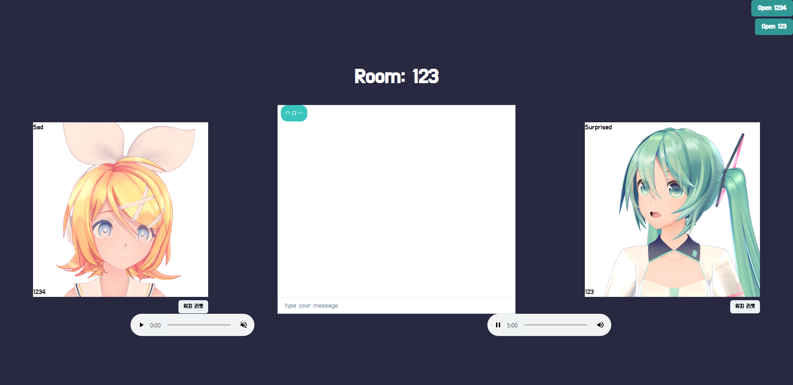

# Virtual Chat

|                 アキテクチャ                 |             入場             |
| :------------------------------------------: | :--------------------------: |
|  |  |
|                 アバター選択                 |         チャット画像         |
|              |  |

**自分の姿をアバターで表現できるコミュニケーションアプリ**

Tensorflow と OpenCV を使ってユーザーのモーションを認識します。  
その結果を WebSocket で転送し、ブラウザ上では WebGL で 3D アバターをレンダリングします。

## 実装機能

- 相手とアバター・音声・テキストを通じてコミュニティー
- アバターはユーザーの頭・目・口の動き、そして表情に 
 応じて動く
- 五つのアバター中で自分のアバターを選べる

## How to run

heroku のサーバーを利用する場合は１，２番を省略

1. npm run start-react
2. npm run start-server
3. cd python
4. python ./start.py 　// ライブラリインストール必要
5. カメラ ID（大体１）, ユーザーネーム、ルーム番号入力
6. 最後に Local サーバーの場合は Y、デプロイサーバーの場合は N を入力

## Deploy

[フロントエンドのデプロイリンク](https://virtual-chat-aio.herokuapp.com)

無料サーバーを使っているため最初の接続の時は時間がかかります。(Cold Start)

## 技術スタック

    
    
    
    
    
    
    
    
    
    
    

## Reference

### TF モデル

- Face Analysis - https://github.com/deepinsight/insightface
- Emotion - https://github.com/omar178/Emotion-recognition
- Face Detection - https://github.com/deepinsight/insightface
- Laser-Eye - https://github.com/1996scarlet/Laser-Eye
- Head-Pose - https://github.com/1996scarlet/Dense-Head-Pose-Estimation

### 3D Model

- YYB Miku - https://bowlroll.net/file/146083
- Tda Kizuna ai - ai https://kizunaai.com/en/download/
- Sour rin - https://bowlroll.net/file/155105
- TDA Miku - https://bowlroll.net/file/4576
- TOFU - https://bowlroll.net/file/246787
