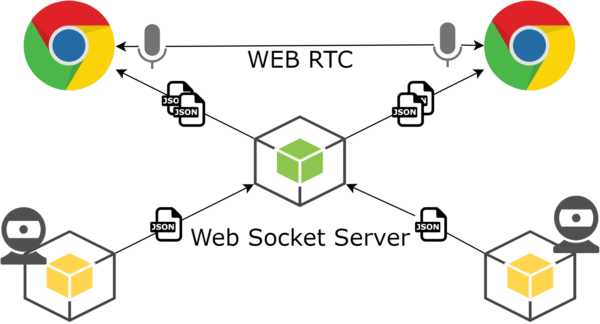

# Virtual Chat

[구글 슬라이드 링크](https://docs.google.com/presentation/d/1HkwofWICzdM60nBABb_E61VtW3RlkxvAurUfdCMjmnE/edit?usp=sharing)

python openCV와 tensorflow를 통한 얼굴 모션 인지를 사용한 아바타 화상 채팅 프로그램  
WebSocket과 WebRTC를 활용해 실시간 채팅, 음성 통화 데이터 전송을 구현  
Three JS를 이용해 3D 모델링 실시간 랜더링

## run start

1. npm run start-react
2. npm run start-server
3. cd python
4. python ./start.py

## Deploy

[리액트, 노드 서버 링크](https://virtual-chat-aio.herokuapp.com)

## Reference

- https://github.com/deepinsight/insightface
- https://github.com/1996scarlet/faster-mobile-retinaface
- https://github.com/nomadcoders/noom
- https://github.com/omar178/Emotion-recognition
- https://github.com/1996scarlet/Laser-Eye
- https://github.com/1996scarlet/Dense-Head-Pose-Estimation
